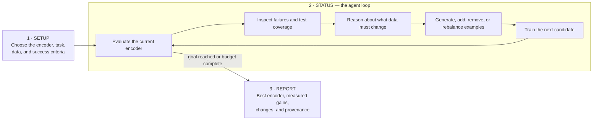

<!-- README.md -->

<div align="center">

# Encoder Gym

### Local, reproducible encoder development—from data to decision.

**Generate, curate, train, evaluate, analyze, and improve text encoders while preserving the evidence behind every change.**

[](https://www.rust-lang.org/)
[](docs/PLATFORM.md)
[](ui/README.md)
[](docs/PRODUCTION_READINESS.md)

[Start Here](#start-here) • [Why Encoder Gym?](#why-encoder-gym) • [The Encoder Loop](#the-encoder-loop) • [Quick Start](#quick-start) • [Governance](#governance--provenance) • [Architecture](#architecture) • [Limitations](#limitations) • [Documentation](#links) • [GitHub](https://github.com/yafitzdev/encoder-gym)

</div>

<br />

---

<a id="start-here"></a>

### Where to start 🚀

> [!IMPORTANT]
> The checked-in pilot exercises the complete local workflow with deterministic
> synthetic data and hashing-linear training. It needs no API key, network,
> model download, Python environment, or GPU.

```powershell
$env:SYNTH_DATABASE_URL = "sqlite://encoder-gym-demo.db?mode=rwc"

cargo run -p synthetic-data-cli -- project bootstrap-preview demo/project-bootstrap.toml
cargo run -p synthetic-data-cli -- project bootstrap demo/project-bootstrap.toml
```

Preview writes nothing. Bootstrap creates the immutable inputs and prints the
exact next command for starting the workflow. Continue with that command, then
use `workflow status` to see the next explicit decision.

See the [Pilot Quick Start](docs/QUICKSTART.md) for the full offline run.

---

### About

An **encoder** takes an input, just like an LLM. Instead of generating a
response, it turns that input into a useful representation. Fine-tune it for a
task and it can classify, rank, or compare inputs quickly and cheaply.

Encoder Gym handles the full improvement loop: data generation and curation,
training, evaluation, error analysis, and comparison. Its agent inspects the
evaluation and test set, reasons about which data should be added or removed,
trains the next candidate, and checks whether it is actually better.

The idea is simple: set up Encoder Gym, start a run, go to sleep, and wake up to
a better encoder than the one you had before—with the evidence to prove it.

---

### Why Encoder Gym?

**Agent-native, with tools 🤖**
> The agent can inspect evaluation evidence, reason about dataset weaknesses,
> use bounded tools to change the data, train another candidate, and measure the
> result.

**Recovery built in ♻️**
> Runs, artifacts, and decisions are persisted as work happens. Interrupted
> training and optimization can be inspected, resumed, or safely replayed.

**Custom-made GUI 🖥️**
> A purpose-built desktop interface makes encoder projects, datasets, runs, and
> results easy to manage. The CLI provides precise, scriptable control.

**Fully local 🏠**
> Data, models, SQLite state, evaluation, and supported training can stay on
> your machine. External model providers are optional.

---

### What You Can Do

| Stage | What Encoder Gym does | Durable output |
|-------|-----------------------|----------------|
| **Generate or import data** | Builds explicit coverage plans, generates bounded synthetic examples, or imports JSONL/CSV rows with source provenance. | Dataset rows and generation receipts |
| **Curate and version** | Audits row quality, records reviews, and freezes exact train/validation/test membership. | Immutable dataset snapshot |
| **Train** | Runs deterministic hashing-linear training or a supported local BERT-family CPU backend. | Training run and checksum-verified checkpoints |
| **Evaluate** | Applies a persisted benchmark contract to an exact checkpoint and immutable cohort. | Predictions, metrics, and acceptance evidence |
| **Analyze** | Aggregates persisted errors by label and arbitrary categorical dimensions without rerunning the model. | Error report and inspectable findings |
| **Improve** | Converts eligible development findings into finite, reviewable data recommendations and generation plans. | Optimization proposal, review, and successor plan |

Optional bounded capabilities add authenticity research, dataset architecture,
row qualification, generation supervision, benchmark architecture, declarative
project preparation, and production-task adapters around the same core artifact
contracts.

---

### The Encoder Loop



Setup defines the job. Status is the working loop: evaluate, understand the
failures, improve the data, and train again. Report delivers the best candidate
along with its measurements and a trace of how it was produced.

---

<a id="quick-start"></a>

<details>

<summary><strong>📦 Quick Start</strong></summary>

<br />

#### Prerequisites

- Git
- Rust `1.85` or newer through `rustup`
- The `rustfmt` and `clippy` components requested by `rust-toolchain.toml`
- Node.js `22.19` or newer and npm only when running the desktop app

The repository pins the stable Rust toolchain profile and required components.

#### Inspect the CLI

```text
cargo run -p synthetic-data-cli -- --help
```

The executable is currently named `synth`. Human-readable output is the
default; add `--output json` before a subcommand for one machine-readable JSON
value on stdout.

#### Run the complete offline pilot

```powershell
$env:SYNTH_DATABASE_URL = "sqlite://encoder-gym-demo.db?mode=rwc"

cargo run -p synthetic-data-cli -- project bootstrap-preview demo/project-bootstrap.toml
cargo run -p synthetic-data-cli -- --output json project bootstrap demo/project-bootstrap.toml
```

Run the exact workflow command printed by bootstrap:

```text
cargo run -p synthetic-data-cli -- workflow start <DEFINITION_ID>
cargo run -p synthetic-data-cli -- workflow status <RUN_ID>
```

If the workflow pauses for review, inspect its status and approve only that
bounded iteration:

```text
cargo run -p synthetic-data-cli -- workflow approve <RUN_ID>
```

Development completion, sealed evaluation, and promotion remain separate:

```text
cargo run -p synthetic-data-cli -- workflow finalize <RUN_ID>
cargo run -p synthetic-data-cli -- workflow promote <RUN_ID>
cargo run -p synthetic-data-cli -- provenance workflow-run <RUN_ID>
cargo run -p synthetic-data-cli -- doctor
```

See [Pilot Quick Start](docs/QUICKSTART.md) for expected outputs,
idempotent replay, and the opt-in real-provider smoke.

#### Launch Encoder Gym desktop

```powershell
cd ui
npm ci
npm start
```

The desktop starts with an empty project library. Creating or opening a project
does not start training, evaluation, or a provider call. See the
[Desktop Guide](ui/README.md).

</details>

---

<a id="governance--provenance"></a>

<details>

<summary><strong>📦 Governance and Provenance</strong> → <a href="docs/features/governance/workflow-governance-spec.md">Full Workflow Contract</a></summary>

<br />

Encoder Gym treats experiment governance as executable product behavior:

| Boundary | Enforced behavior |
|----------|-------------------|
| Dataset history | Completed snapshots and derived artifacts are immutable. |
| Benchmark leakage | Trainer-visible data must pass a strict persisted contamination check against the bound benchmark population. |
| Evidence roles | Development evidence may support adaptation; sealed evidence is aggregate-only and non-adaptive. |
| Agent authority | Bounded agents may inspect or propose; deterministic validation and explicit reviews decide what becomes active. |
| External calls | Provider operations require configured authority and persisted finite request, attempt, token, and optional cost limits. |
| Long-running work | Child identities, attempts, cancellation, and recovery are persisted before or alongside execution. |
| Acceptance | Deterministic benchmark contracts decide pass, fail, inconclusive, or invalid. |
| Promotion | Finalization and promotion are explicit operations with immutable records. |

Provenance follows source snapshots, plans, model artifacts, evaluations,
reports, reviews, and decisions. Use the `provenance` command family to inspect
the complete dependency tree for a supported artifact.

See [Provenance](docs/PROVENANCE.md), [Benchmark Stewardship](docs/features/evaluation/benchmark-stewardship-spec.md),
and [Controlled Workflow Governance](docs/features/governance/workflow-governance-spec.md).

</details>

---

<a id="desktop"></a>

<details>

<summary><strong>📦 Encoder Gym Desktop</strong> → <a href="ui/README.md">Desktop Guide</a></summary>

<br />

The Electron desktop is a local multi-project workspace. It can create and open
Gym-owned folders, copy supported checkpoints into managed custody, import and
version datasets, inspect models and recorded runs, compare compatible benchmark
results, manage provider connections, verify project files, and export a
hash-chained activity journal.

The renderer receives typed, bounded data through the desktop bridge. It cannot
read arbitrary paths, provider credentials, sealed scores, sealed rows, or raw
native diagnostics. Adding a folder or saving configuration never authorizes
training or provider spending.

The desktop is not yet a graphical surface for every independent platform
slice. Generic presentation and managed custody are broader than execution:
production task execution still requires a compatible compiled adapter, and the
existing experiment CLI is currently wired to Nomos.

```powershell
cd ui
npm ci
npm start
```

</details>

---

<a id="architecture"></a>

<details>

<summary><strong>📦 Architecture</strong> → <a href="docs/ARCHITECTURE.md">Full Architecture Guide</a></summary>

<br />

```text
Electron desktop        synth CLI        local generation server
        └──────────────────┼──────────────────┘
                           ▼
              application composition and runners
                           ▼
        project preparation + finite workflow contracts
                           ▼
 generation → dataset → training → evaluation → analysis → optimization
                           ▼
        SQLite persistence + immutable files + backend adapters
```

Core crates own domain objects and replaceability contracts. SQLite, HTTP,
provider SDKs, process execution, CLI parsing, and presentation remain in
adapters or applications. A later stage consumes immutable artifacts from the
previous stage instead of importing its infrastructure types.

The original local HTTP server remains a generation control surface; the newer
dataset-through-optimization capabilities are CLI-first.

</details>

---

<a id="cli-reference"></a>

<details>

<summary><strong>📦 CLI Reference</strong> → <a href="docs/CLI.md">Full CLI Guide</a></summary>

<br />

| Command family | Purpose |
|----------------|---------|
| `project`, `config` | Preview, resolve, and atomically prepare a finite encoder project. |
| `dataset`, `snapshot`, `quality` | Create, import, audit, review, version, and inspect data. |
| `plan`, `allocation`, `generate`, `job` | Define coverage and execute bounded generation. |
| `encoder`, `training` | Register supported bundles and run or continue training. |
| `cohort`, `benchmark`, `evaluation` | Define evidence roles and evaluate exact checkpoints. |
| `analysis`, `optimize`, `advisor` | Diagnose persisted errors and prepare reviewable improvements. |
| `workflow` | Execute the finite governed cross-slice workflow. |
| `experiment`, `encoder optimize`, `production-campaign` | Run bounded adapter-backed production encoder work. |
| `workspace` | Manage desktop-owned projects, custody, providers, benchmarks, and optimization inputs. |
| `recovery`, `provenance`, `doctor` | Recover interrupted work and verify stored facts. |

Inspect the live command tree rather than relying on copied examples:

```text
cargo run -p synthetic-data-cli -- --help
cargo run -p synthetic-data-cli -- workflow --help
cargo run -p synthetic-data-cli -- workspace --help
```

Human output is the default. Place `--output json` before the subcommand for one
machine-readable JSON value on stdout; diagnostics remain on stderr.

</details>

---

<a id="limitations"></a>

<details>

<summary><strong>📦 Limitations</strong></summary>

<br />

| Boundary | Current behavior |
|----------|------------------|
| Product scope | Local, single-user operation; no authentication, hosted control plane, multi-user collaboration, or distributed workers. |
| Standard task | The complete generic slice workflow currently targets text classification. Other encoder tasks require compiled adapters. |
| Desktop coverage | The desktop manages projects and evidence but does not expose every CLI workflow or every production adapter. |
| Trainer support | Hashing-linear and supported BERT-family CPU bundles; arbitrary model code and pickle-based weights are not accepted. |
| Contamination detection | Exact source, exact text, normalized text, and declared group checks—not semantic or embedding deduplication. |
| External provenance | The platform cannot prove that benchmark content was absent from a pretrained base model or training performed elsewhere. |
| Automation | Workflows are finite, persisted, and bounded. There is no open-ended autonomous optimization loop. |
| Compatibility | The repository is at `0.1.0`; public package and long-term compatibility commitments have not been declared. |

The complete scope and non-goals are in the
[Limitations](docs/LIMITATIONS.md).

</details>

---

### License

A project license has not been published yet. Until one is added, this
repository is not offered under an open-source license.

---

### Links

- [GitHub](https://github.com/yafitzdev/encoder-gym)
- [Documentation](docs/README.md)
- [Platform Specification](docs/PLATFORM.md)
- [Pilot Quick Start](docs/QUICKSTART.md)
- [CLI Guide](docs/CLI.md)
- [Desktop Guide](ui/README.md)
- [Architecture](docs/ARCHITECTURE.md)
- [Provenance](docs/PROVENANCE.md)
- [Production Readiness](docs/PRODUCTION_READINESS.md)
- [Development Guide](docs/DEVELOPMENT.md)

Yan Fitzner — [GitHub](https://github.com/yafitzdev) • [Hugging Face](https://huggingface.co/yafitzdev)
